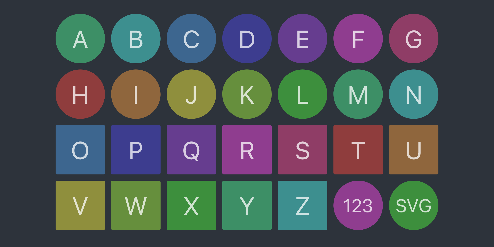

# Initials [](https://codeclimate.com/github/thutterer/initials/maintainability) [](https://codeclimate.com/github/thutterer/initials/test_coverage)

Don't want to implement user avatar uploads but still have basic avatars to distinguish users and brigthen up your app?

Use colorful SVGs as user avatars in any Ruby and Rails application.



## Installation

Add this line to your application's Gemfile:

```ruby
gem 'initials'
```

And then execute:

    $ bundle

Or install it yourself as:

    $ gem install initials

## Usage

Call `Initials.svg("Morty Smith")` anywhere to get a colorful initials avatar SVG as string.
The avatar's background color is based on the provided name and the font-size is adjusted to fit between one and three character initials.

### Rails

No special configuration is required to work with Ruby on Rails, but for your convinience, you can add this to your `app/helpers/application_helper.rb`:

```ruby
def user_avatar(name, **options)
  Initials.svg(name, **options)
end
```

Now you can create SVGs in all views:

```erb
<%= user_avatar(current_user.name) %>
```

Initials automatically marks its created SVG strings as `html_safe`.

### Options

You can pass the following options into `Initials.svg` or your `user_avatar` helper:

```ruby
user_avatar(current_user.name, 
  limit: 1, # sets max length for initials
  size: 96  # sets SVG height and width in pixel
)
```

Of course, you can also use CSS to make the SVG have different sizes in different places of your HTML.

## Development

After checking out the repo, run `bin/setup` to install dependencies. Then, run `rake spec` to run the tests. You can also run `bin/console` for an interactive prompt that will allow you to experiment.

To install this gem onto your local machine, run `bundle exec rake install`. To release a new version, update the version number in `version.rb`, and then run `bundle exec rake release`, which will create a git tag for the version, push git commits and tags, and push the `.gem` file to [rubygems.org](https://rubygems.org).

## Contributing

Bug reports and pull requests are welcome on GitHub at https://github.com/thutterer/initials.

## License

The gem is available as open source under the terms of the [MIT License](https://opensource.org/licenses/MIT).
